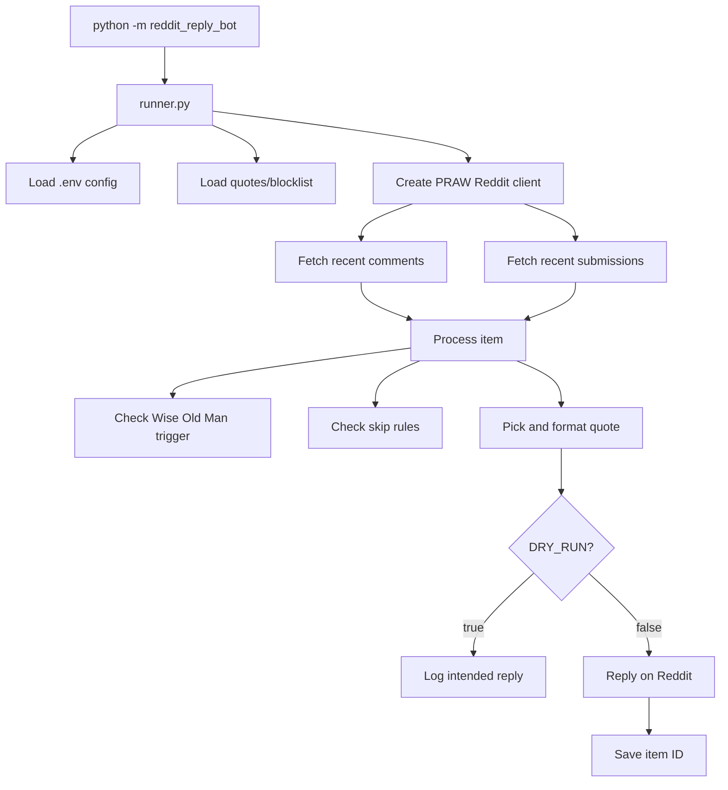

# Code Overview

This project is a small Reddit bot for replying when someone mentions the Wise Old Man from Old School RuneScape.

The main command is:

```powershell
conda run -n reddit-reply-bot python -m reddit_reply_bot --limit 25
```

That command runs a one-shot poll using the `reddit-reply-bot` Conda environment. It checks recent comments and submissions from the configured subreddit list, processes each item, then exits.

Continuous mode uses the same processing path in a loop:

```powershell
conda run -n reddit-reply-bot python -m reddit_reply_bot --loop --interval-seconds 300 --limit 50
```

## High-Level Flow



## Important Files

`reddit_reply_bot/__main__.py`

This is the command-line entrypoint. It lets Python run the package with:

```powershell
python -m reddit_reply_bot
```

It just calls `runner.main()`.

`reddit_reply_bot/runner.py`

This wires the application together. It:

- Loads config from `.env`
- Loads `quotes.json`
- Loads `blocked_users.json`
- Creates the PRAW Reddit client
- Fetches recent comments and submissions
- Sends each item to `bot.py`
- Repeats polling when `--loop` is enabled

This is the closest thing to the "main program."

`reddit_reply_bot/bot.py`

This processes one Reddit item at a time. It has two public functions:

- `process_comment(...)`
- `process_submission(...)`

For each item, it:

1. Extracts metadata like item ID, author, subreddit, and item type.
2. Checks whether the comment body, submission title, or submission body mentions Wise Old Man.
3. Checks skip rules like blocked users, already-replied IDs, bot's own username, and cooldown.
4. Picks a quote.
5. If `DRY_RUN=true`, logs what it would reply.
6. If `DRY_RUN=false`, replies on Reddit and records the item ID.

`reddit_reply_bot/matcher.py`

This handles trigger detection. The main function is:

```python
contains_wise_old_man(text)
```

It matches these variants case-insensitively:

- `wise old man`
- `wise oldman`
- `wiseold man`
- `wiseoldman`

`reddit_reply_bot/reply_flow.py`

This contains reply decision helpers. The key function is:

```python
should_reply(...)
```

It returns `False` when:

- The item was already replied to
- The user is blocked
- The author is the bot itself

`reddit_reply_bot/quotes.py`

This selects and formats quotes. It replaces:

```text
[player name]
```

with the Reddit author's username.

`reddit_reply_bot/storage.py`

This loads and saves replied item IDs. The local runtime file is:

```text
replied_items.json
```

That file is ignored by Git because it is local runtime state.

`reddit_reply_bot/config.py`

This loads configuration from environment variables and `.env`.

Important settings:

- `REDDIT_CLIENT_ID`
- `REDDIT_CLIENT_SECRET`
- `REDDIT_USERNAME`
- `REDDIT_PASSWORD`
- `REDDIT_USER_AGENT`
- `REDDIT_SUBREDDITS`
- `DRY_RUN`

`reddit_reply_bot/data_files.py`

This loads and validates:

- `quotes.json`
- `blocked_users.json`

It makes sure the files contain JSON lists of strings.

`reddit_reply_bot/reddit_client.py`

This creates the PRAW client.

`reddit_reply_bot/runtime.py`

This contains utility code for runtime safety:

- Deleted author handling
- Cooldown tracking
- Retry with exponential backoff
- Structured JSON logs

## Dry Run vs Live Mode

Dry run is controlled by `.env`:

```text
DRY_RUN=true
```

In dry-run mode, the bot logs the intended reply but does not post and does not save the item ID.

Live mode:

```text
DRY_RUN=false
```

In live mode, the bot replies on Reddit and writes the item ID to `replied_items.json`.

## Tests

Tests live in `tests/`.

Run them with:

```powershell
conda run -n reddit-reply-bot python -m unittest discover -s tests
```

The tests cover:

- Keyword matching
- Comment and submission processing
- Dry-run behavior
- Live reply persistence
- Blocked users
- Already-replied items
- Quote formatting
- Config loading
- JSON data file validation
- Runtime logging and cooldowns

Most tests do not need Reddit. They use fake comment/submission objects so the core behavior can be tested safely.

## What To Change For Common Tasks

To change trigger phrases, edit:

```text
reddit_reply_bot/matcher.py
```

To add or edit replies, edit:

```text
quotes.json
```

To change skip behavior, edit:

```text
reddit_reply_bot/reply_flow.py
reddit_reply_bot/bot.py
```

To change Reddit polling behavior, edit:

```text
reddit_reply_bot/runner.py
```

To change config settings, edit:

```text
reddit_reply_bot/config.py
.env.example
```
