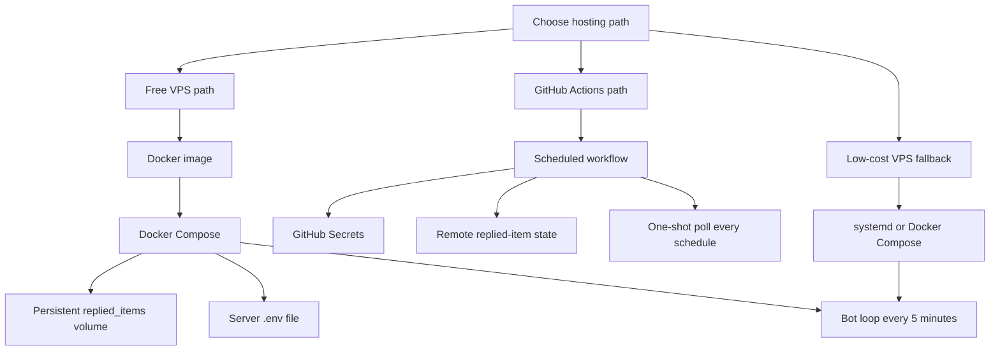

# Cloud Continuous Options Plan

**Date:** 2026-05-20

<big><big><strong>📌 Goal</strong></big></big>

Choose the next deployment path for running the bot continuously while the laptop is asleep or turned off.

The target is a free or near-free setup that can:

- Run the bot every 5 minutes or continuously.
- Keep Reddit credentials out of Git.
- Persist replied item IDs across runs.
- Be simple enough to operate without a lot of cloud maintenance.

The leading options are:

- Docker on an always-free VPS.
- GitHub Actions scheduled runs with redesigned persistence.
- A cheap paid VPS if the free options are too unreliable.

<big><big><strong>📌 High Level Architecture</strong></big></big>

## Option 1: Docker On A Free VPS

This is the cleanest deployment model if Oracle Cloud Always Free or Google Cloud Free Tier works.

Benefits:

- Docker packages Python dependencies.
- No Conda setup needed on the server.
- Easy to run with `docker compose up -d`.
- Local `data/` volume can persist `replied_items.json`.
- Works naturally with the current continuous loop.

Main risk:

- Free VPS signup/capacity can be annoying, especially Oracle.

## Option 2: GitHub Actions Scheduled Runs

This may be the most convenient free option if a true server is hard to get.

Benefits:

- No server to manage.
- GitHub Secrets can store Reddit credentials.
- The bot already supports one-shot polling.

Main problem:

- GitHub Actions runners are temporary. Local `replied_items.json` will not persist unless we redesign state.

Possible state solutions:

- Store replied IDs in a private GitHub Gist.
- Store replied IDs in a private repo file and commit it from the workflow.
- Use a free external key-value store.

This path needs more careful design because duplicate prevention must be reliable.

## Option 3: Cheap Paid VPS

If free cloud becomes frustrating, a tiny paid VPS is the simplest reliable option.

Benefits:

- Predictable uptime.
- Full control.
- Easy `systemd` or Docker Compose deployment.

Cost:

- Usually about $3-6/month.

<big><big><strong>📌 Work Items</strong></big></big>

| Done | Work Item | Subtasks | Notes |
| --- | --- | --- | --- |
| No | 1. Decide first deployment target | a. Try Oracle Cloud Always Free b. If blocked, evaluate Google Cloud e2-micro c. If both are painful, consider GitHub Actions | A real VPS keeps state simple. |
| Yes | 2. Dockerize the bot | a. Add `Dockerfile` b. Add `.dockerignore` c. Add `docker-compose.yml` d. Mount `.env` and persistent `data/` volume | Implemented for VPS deployment. |
| Yes | 3. Move runtime state into `data/` | a. Default `REPLIED_ITEMS_PATH` to `data/replied_items.json` b. Ignore `data/replied_items.json` c. Keep data directory mountable in Docker | Runtime state is explicit and mountable. |
| Yes | 4. Add Docker docs | a. Local Docker build b. Local Docker dry-run c. Server Docker Compose run d. Logs and restart commands | Added README and deployment docs. |
| No | 5. Evaluate GitHub Actions fallback | a. Design persistent state backend b. Add workflow only if state design is acceptable c. Keep scheduled run at 5 minutes or more | Do not use Actions until duplicate prevention is solved. |
| No | 6. Production rollout | a. Run `DRY_RUN=true` first b. Confirm logs c. Switch `DRY_RUN=false` d. Monitor first day of replies | Start in `r/test`, then move to target subreddits. |

## Recommendation

Next implementation should be Dockerization plus explicit `data/` runtime state.

That keeps the current bot architecture intact and gives us the most portable deployment artifact. Once Docker works locally, the same image can run on Oracle Cloud, Google Cloud, or a cheap VPS.

