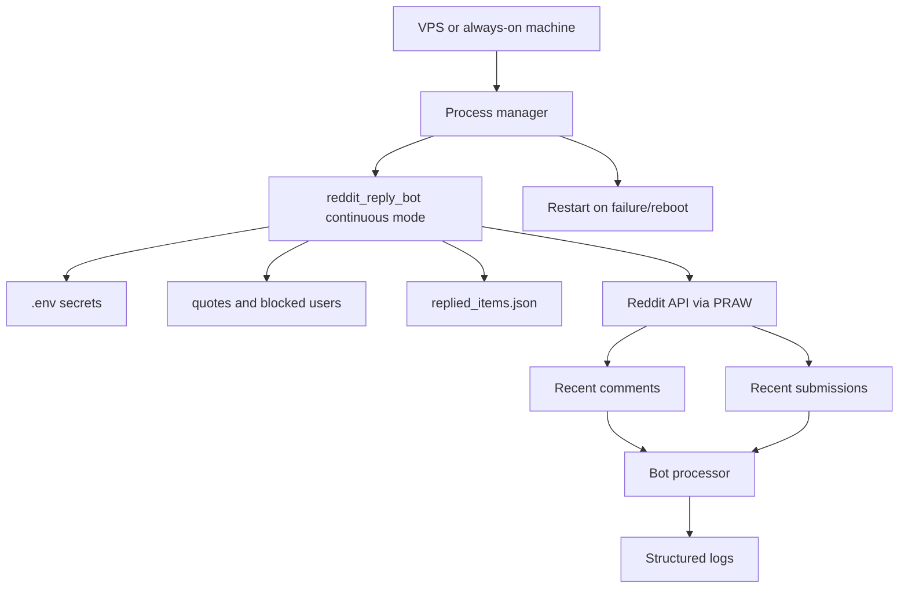

# Continuous Hosting Plan

**Date:** 2026-05-20

<details open>
<summary><big><big><strong>📌 Goal</strong></big></big></summary>

Run the Wise Old Man Reddit bot continuously so it can monitor configured subreddits and reply without manual one-shot polling.

The recommended path is:

- Keep the current one-shot poller for local testing.
- Add a continuous loop mode that polls once every 5 minutes by default.
- Deploy it on a small VPS or always-on machine.
- Run it under a process manager so it restarts after crashes or reboots.

A server is the cleanest long-term option. The bot does not need much compute; it mainly needs stable internet, persistent local storage for `replied_items.json`, and a safe way to keep `.env` secrets off GitHub.

</details>

<details>
<summary><big><big><strong>📌 High Level Architecture</strong></big></big></summary>



## Hosting Options

| Option | Fit | Notes |
| --- | --- | --- |
| Local machine | Good for testing | Works only while your computer is awake and online. |
| Small VPS | Best first production option | Cheap, simple, stable, and enough for this bot. |
| Raspberry Pi/home server | Fine if already available | Requires reliable power/network and some maintenance. |
| Cloud function/serverless | Poor fit | The bot wants recurring polling and local state; long-running processes are simpler. |

## Runtime Model

The bot should use polling rather than Reddit streams at first:

- Poll recent comments.
- Poll recent submissions.
- Process each item through existing `bot.py`.
- Sleep for a configurable interval, defaulting to 300 seconds.
- Repeat until interrupted.

Polling every 5 minutes is frequent enough for this novelty bot and more conservative than checking every minute. It is easier to test and recover from than blocking streams. It also works naturally with `replied_items.json`, so repeated scans do not create duplicate replies.

</details>

<details open>
<summary><big><big><strong>📌 Work Items</strong></big></big></summary>

| Done | Work Item | Subtasks | Notes |
| --- | --- | --- | --- |
| Yes | 1. Add continuous mode | a. Add `--loop` flag<br>b. Add `--interval-seconds` flag defaulting to `300`<br>c. Keep current one-shot behavior as default<br>d. Handle `Ctrl+C` cleanly | Implemented in `runner.py`; five-minute polling is the production default. |
| Yes | 2. Improve runtime state | a. Keep `replied_items.json` ignored<br>b. Ensure duplicate skips survive restarts<br>c. Consider rotating or compacting state later | Runtime state stays local and ignored; JSON remains acceptable for this scale. |
| Yes | 3. Add production logging | a. Log startup config without secrets<br>b. Log every reply/skip result<br>c. Write logs to stdout for process managers<br>d. Optionally add file logging later | Startup and reply/skip logs go to stdout without secrets. |
| Yes | 4. Add deployment docs | a. Document VPS setup<br>b. Document copying `.env` manually<br>c. Document Conda env creation<br>d. Document dry-run validation on server | Added `DEPLOYMENT.md`. |
| Yes | 5. Add process manager config | a. Prefer systemd on Linux VPS<br>b. Set restart policy<br>c. Set working directory<br>d. Run `conda run -n reddit-reply-bot ...` | Added `deploy/reddit-reply-bot.service.example`. |
| Yes | 6. Production dry-run checklist | a. Run with `DRY_RUN=true` on server<br>b. Confirm logs show expected matches<br>c. Confirm no real replies are posted<br>d. Switch to `DRY_RUN=false` only after validation | Documented in `DEPLOYMENT.md`; use `r/test` first, then target subreddit. |

## First Implementation Target

Add continuous mode to the existing runner:

```powershell
conda run -n reddit-reply-bot python -m reddit_reply_bot --loop --interval-seconds 300 --limit 50
```

The existing command should still run once and exit:

```powershell
conda run -n reddit-reply-bot python -m reddit_reply_bot --limit 25
```

## Suggested VPS Shape

A very small Linux VPS is enough:

- 1 vCPU
- 512 MB to 1 GB RAM
- 5 GB or more disk
- Ubuntu LTS
- systemd service

The important part is operational reliability, not compute size.

</details>
