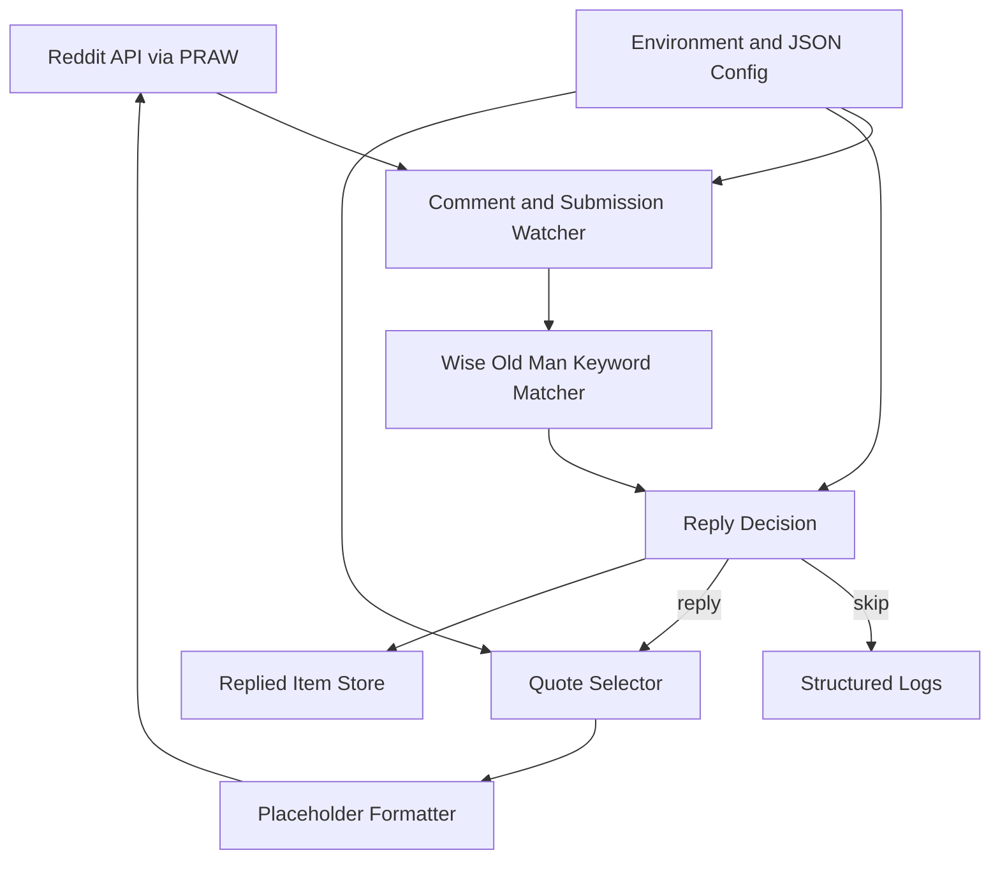

# Wise Old Man Reply Bot Plan

**Date:** 2026-05-19

<details open>
<summary><big><big><strong>📌 Goal</strong></big></big></summary>

Build a Reddit bot that watches selected subreddits and replies whenever a post title or comment body mentions the Wise Old Man from Old School RuneScape. Replies should be selected from a curated list of Wise Old Man quotes, with optional placeholder substitution such as replacing `[player name]` with the Reddit author's username.

The first milestone should produce a small, safe implementation that:

- Uses environment-based Reddit credentials
- Loads quotes and blocklist from JSON
- Detects Wise Old Man mentions in comments and submission titles
- Supports dry-run mode
- Stores replied item IDs
- Has unit tests for matching and reply decision logic

</details>

<details>
<summary><big><big><strong>📌 High Level Architecture</strong></big></big></summary>



## Trigger Behavior

The bot should match mentions in both:

- New comments
- New submission titles

Initial keyword variants:

- `wise old man`
- `wise oldman`
- `wiseold man`
- `wiseoldman`

Matching should be case-insensitive and should avoid brittle ad hoc checks. A compiled regex with normalized input is enough for the first version.

## Proposed Module Shape

```text
reddit_reply_bot/
  __init__.py
  config.py
  reddit_client.py
  matcher.py
  quotes.py
  storage.py
  bot.py
tests/
  test_matcher.py
  test_quotes.py
  test_storage.py
quotes.json
blocked_users.json
replied_items.json
```

If the project should stay very small, this can start as a single `bot.py` plus tests and later be split once behavior settles.

## Runtime Flow

1. Load configuration and data files.
2. Initialize the PRAW Reddit client.
3. Start comment stream for configured subreddits.
4. Start submission stream for configured subreddits.
5. For each incoming item:
   - Extract searchable text.
   - Extract author username, using `[deleted]` when missing.
   - Check blocked users and reply history.
   - Match Wise Old Man keywords.
   - Reply with a random quote.
   - Save the item ID.

PRAW streams are blocking, so watching comments and submissions at the same time will require either separate worker threads or a polling approach. For a first implementation, polling recent comments and submissions on a short interval may be simpler and easier to test.

</details>

<details open>
<summary><big><big><strong>📌 Work Items</strong></big></big></summary>

| Done | Work Item | Subtasks | Notes |
| --- | --- | --- | --- |
| Yes | 1. Trigger detection | a. Match new comments<br>b. Match new submission titles<br>c. Support keyword variants<br>d. Keep matching case-insensitive | Implemented in `reddit_reply_bot/matcher.py`. Initial variants: `wise old man`, `wise oldman`, `wiseold man`, `wiseoldman`. |
| Yes | 2. Reply flow | a. Skip already-replied items<br>b. Skip blocked users<br>c. Select a random quote<br>d. Replace `[player name]`<br>e. Reply to Reddit<br>f. Persist the item ID after success | Implemented with `reply_to_matched_item`, using an injected reply function so Reddit calls can be wired in later. |
| Yes | 3. Configuration and data | a. Move credentials to environment variables<br>b. Load target subreddits from config<br>c. Load `quotes.json`<br>d. Load `blocked_users.json`<br>e. Store replies in `replied_items.json` or SQLite | Implemented with `.env` support, validated JSON data loaders, and default local data files. Old hardcoded credentials should be rotated before reuse. |
| Yes | 4. Runtime reliability | a. Handle deleted authors<br>b. Avoid replying to the bot's own account<br>c. Add cooldown protection<br>d. Respect Reddit rate limits<br>e. Use backoff for transient API errors<br>f. Add structured logging | Implemented with metadata extraction, cooldown tracking, retry/backoff, and JSON event logging helpers. |
| Yes | 5. Test coverage | a. Test keyword variants and casing<br>b. Test non-matches<br>c. Test deleted author handling<br>d. Test placeholder replacement<br>e. Test blocked user skips<br>f. Test already-replied skips | Implemented with 38 unittest tests, including deterministic quote selection through an injected random source. |
| Yes | 6. Dry-run validation | a. Configure a test subreddit<br>b. Run in dry-run mode<br>c. Create matching comments and submissions<br>d. Confirm intended replies are logged<br>e. Disable dry-run for one real reply<br>f. Restart and confirm no duplicate reply | Implemented dry-run processing that logs intended replies without posting or persisting item IDs. |

## Reply Behavior Details

When a match is found:

1. Skip the item if it has already been replied to.
2. Skip the item if the author is blocked.
3. Select one quote at random from the configured quote list.
4. Replace supported placeholders, starting with `[player name]`.
5. Reply to the comment or submission.
6. Persist the replied item ID immediately after a successful reply.

The bot should track separate Reddit thing IDs directly, so comments and submissions can share one dedupe store.

## Configuration Details

Do not hardcode secrets in source code. The old script embedded Reddit credentials directly, which is risky and should not be carried forward. Those credentials should be considered exposed and rotated before using the bot again.

Recommended configuration sources:

- Reddit credentials from environment variables or a local `.env` file ignored by Git
- Target subreddits from config
- Quote list from `quotes.json`
- Blocked users from `blocked_users.json`
- Reply history from a small local persistence file or database

Suggested environment variables:

- `REDDIT_CLIENT_ID`
- `REDDIT_CLIENT_SECRET`
- `REDDIT_USERNAME`
- `REDDIT_PASSWORD`
- `REDDIT_USER_AGENT`
- `REDDIT_SUBREDDITS`

Minimum local files:

- `quotes.json`: list of possible Wise Old Man replies
- `blocked_users.json`: list of usernames the bot should never reply to
- `replied_items.json`: list or object containing Reddit IDs already handled

For a simple bot, JSON is acceptable. If the bot grows, SQLite would be more reliable for atomic writes, timestamps, and auditability.

## Implementation Improvements Over The Old Script

- Move credentials out of the codebase.
- Remove unused imports such as `datetime`, `sys`, `os`, `logging`, and `pandas` unless they are actually needed.
- Replace `print` debugging with structured logging.
- Handle deleted authors safely.
- Use one reusable keyword matcher.
- Watch both comment stream and submission stream.
- Persist reply history only after a confirmed successful reply.
- Handle rate limits and transient Reddit API errors with backoff.
- Avoid broad infinite loops that hide failures forever.
- Keep bot logic in small testable functions.
- Add tests for keyword matching, quote formatting, blocked users, and dedupe checks.

## Core Functions

Suggested first-pass functions:

```python
def contains_wise_old_man(text: str) -> bool:
    ...

def choose_quote(quotes: list[str], username: str | None) -> str:
    ...

def should_reply(item_id: str, username: str, replied_ids: set[str], blocked_users: set[str]) -> bool:
    ...

def mark_replied(item_id: str) -> None:
    ...
```

## Safety And Abuse Prevention

- Never reply to the bot's own comments or submissions.
- Keep a blocklist for users and optionally subreddits.
- Add a cooldown if repeated matches happen too quickly.
- Log every attempted reply with item ID, subreddit, author, matched text type, and result.
- Respect Reddit API rate limits.
- Make dry-run mode available so matches can be logged without posting replies.

## Testing Details

Add focused tests for:

- Keyword variants and casing
- Non-matches that should not trigger
- Deleted author handling
- Placeholder replacement
- Blocked user skip
- Already replied skip
- Quote selection using a deterministic random seed or injected chooser

Manual dry-run validation:

1. Configure a test subreddit.
2. Run the bot in dry-run mode.
3. Create test comments and submissions containing keyword variants.
4. Confirm the bot logs intended replies without posting.
5. Disable dry-run and confirm one real reply.
6. Restart the bot and confirm it does not reply again to the same item.

</details>
